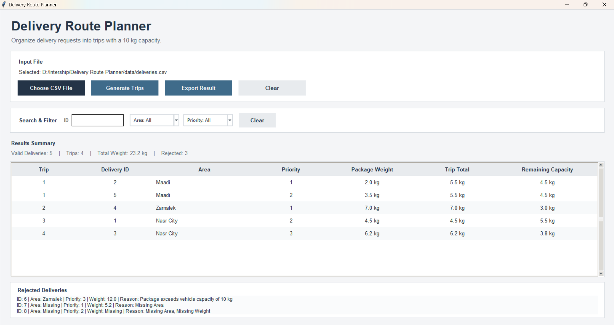
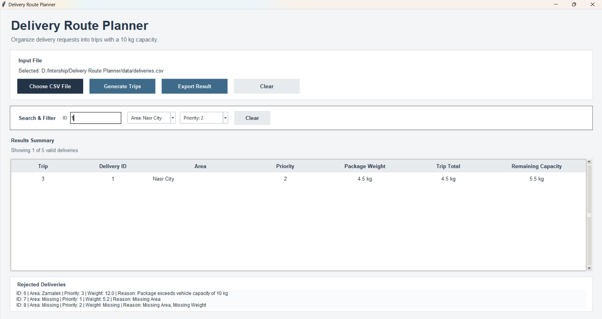
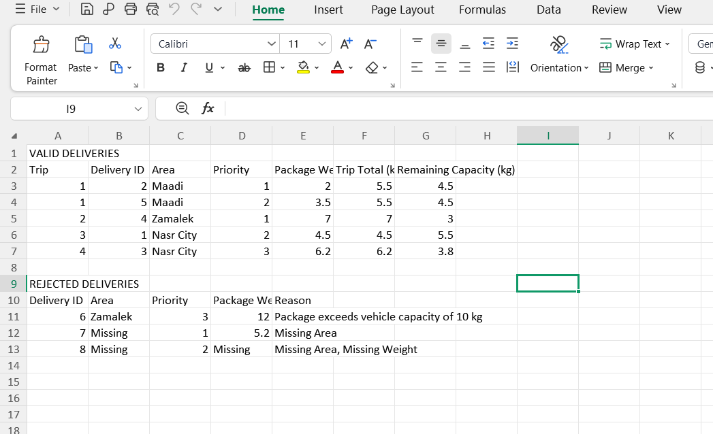

# Delivery Route Planner

A Python application that organizes delivery requests into delivery trips while respecting **vehicle capacity, delivery priority, and area grouping**.

The application reads delivery data from a CSV file, validates the input, groups valid deliveries into trips, displays the results through a Tkinter GUI, and allows the generated results to be exported to a CSV file.

Each vehicle has a maximum capacity of **10 kg per trip**.

---

# Features

* Reads delivery requests from a CSV file.
* Validates delivery data before creating trips.
* Detects missing values.
* Detects invalid IDs, priorities, and weights.
* Detects duplicate delivery IDs.
* Rejects deliveries with zero or negative priority.
* Rejects deliveries with zero or negative weight.
* Rejects packages heavier than the **10 kg vehicle capacity**.
* Processes lower priority numbers first.
* Groups deliveries from the same area when possible.
* Uses delivery ID as a tie-breaker when priority and area are the same.
* Ensures every valid delivery is included in exactly one trip.
* Ensures no trip exceeds the **10 kg capacity**.
* Displays trip total weight.
* Displays remaining vehicle capacity.
* Displays rejected deliveries and their rejection reasons.
* Provides delivery search by ID.
* Provides filtering by area.
* Provides filtering by priority.
* Allows the generated results to be exported to a CSV file.
* Provides a graphical user interface using Tkinter.

---

## Project Structure

```text
delivery-route-planner/
│
├── src/
│   ├── main.py
│   └── delivery_planner.py
│
├── data/
│   ├── deliveries.csv
│   ├── deliveries - empty.csv
│   └── exported_trips.csv
│
├── screenshot/
│   ├── generated_trips.png
│   ├── search_and_filter.png
│   └── exported_csv.png
│
├── README.md
└── requirements.txt
```

---

# How to Run

## Requirements

* Python 3.10 or later
* Tkinter

The application mainly uses Python standard libraries, including:

* `csv`
* `tkinter`
* `ttk`

No external Python packages are required for the current implementation.

## Run the Application

Open a terminal in the project folder and run:

```bash
python src/main.py
```

The Delivery Route Planner GUI will open.

---

# Using the Application

1. Click **Choose CSV File**.
2. Select a delivery CSV file.
3. Click **Generate Trips**.
4. The application reads and validates the delivery data.
5. Valid deliveries are organized into trips.
6. The generated trips are displayed in the results table.
7. Rejected deliveries are displayed in the **Rejected Deliveries** section together with their rejection reasons.
8. Use the **Search & Filter** section to search by Delivery ID or filter by Area and Priority.
9. Click **Export Result** to save the generated trips and rejected deliveries to a CSV file.
10. Click **Clear** to reset the selected file and displayed results.

---

# Input Format

The input CSV file must contain the following columns:

```text
ID,Area,Priority,Weight
```

## Sample Input

```csv
ID,Area,Priority,Weight
1,Nasr City,2,4.5
2,Maadi,1,2.0
3,Nasr City,3,1.2
4,Zamalek,1,7.0
5,Maadi,2,3.5
```

### Column Description

* **ID**: Unique delivery identifier.
* **Area**: Delivery destination area.
* **Priority**: Lower numbers represent higher urgency.
* **Weight**: Package weight in kilograms.

---

# 1. Solution Approach

I divided the solution into several steps:

1. Reading the CSV file.
2. Validating the delivery data.
3. Sorting the valid deliveries.
4. Creating delivery trips.
5. Displaying the results in the GUI.
6. Allowing the user to search and filter the results.
7. Exporting the results to a CSV file.

## Reading the Input

The `read_deliveries()` function in `delivery_planner.py` reads the CSV file using Python's `csv.DictReader`.

The CSV header is converted to lowercase and spaces around column names are removed so that the program can recognize the required columns consistently.

The required columns are:

* ID
* Area
* Priority
* Weight

Each delivery is stored as a dictionary containing:

* `id`
* `area`
* `priority`
* `weight`
* `row_number`

The program converts:

* ID to an integer when possible.
* Priority to an integer when possible.
* Weight to a floating-point number when possible.

If a value cannot be converted, the original value is kept so that the validation function can identify it as invalid and provide an appropriate rejection reason.

---

## Validating the Input

The `validate_deliveries()` function checks every delivery before trip creation.

The following conditions are checked:

### ID Validation

The program rejects a delivery when:

* The ID is missing.
* The ID is not a number.
* The ID already appeared in another delivery.

Duplicate IDs are detected using a `set` called `seen_ids`.

### Area Validation

The program rejects a delivery when the Area field is empty.

### Priority Validation

The program rejects a delivery when:

* Priority is missing.
* Priority is not a number.
* Priority is zero or negative.

The program uses lower priority numbers as higher priority.

For example:

```text
Priority 1 → handled before Priority 2
Priority 2 → handled before Priority 3
```

### Weight Validation

The program rejects a delivery when:

* Weight is missing.
* Weight is not a number.
* Weight is zero or negative.
* Weight is greater than 10 kg.

A package heavier than 10 kg cannot be placed into any trip because the vehicle's maximum capacity is 10 kg.

Invalid deliveries are stored together with their rejection reason and displayed in the GUI.

---

## Missing Column Handling

Before reading the delivery records, `main.py` checks whether the CSV contains all required columns.

The required columns are:

```text
ID
Area
Priority
Weight
```

If one or more columns are missing, the application does not generate trips.

Instead, the missing columns are displayed in the **Rejected Deliveries** section.

For example:

```text
Missing columns: Priority, Weight
```

This prevents the program from trying to process incomplete CSV structures.

---

# Sorting the Deliveries

The `create_trips()` function first sorts valid deliveries using:

```python
(priority, area, id)
```

This means:

1. **Priority is considered first.**
2. If priority is the same, **Area is used for ordering and grouping**.
3. If priority and area are the same, **ID is used as a tie-breaker**.

This gives the program a consistent processing order.

For example, a delivery with priority `1` is considered before a delivery with priority `2`.

---

# Creating the Trips

The maximum vehicle capacity is defined as:

```python
MAX_CAPACITY = 10.0
```

The algorithm starts with the first remaining delivery and creates a new trip.

It then checks the other remaining deliveries.

A delivery can be added to the current trip when:

1. It belongs to the same area as the first delivery of that trip.
2. Adding its weight does not exceed the 10 kg capacity.

The capacity check is:

```python
current_weight + delivery["weight"] <= MAX_CAPACITY
```

If both conditions are satisfied, the delivery is added to the current trip.

If the delivery does not fit or belongs to another area, it remains available to be considered for another trip.

When no more suitable deliveries can be added, the current trip is completed and the algorithm starts another trip using the next remaining delivery.

This process continues until all valid deliveries have been assigned to a trip.

---

# Example of Trip Creation

For the sample data:

```text
ID 2 → Maadi → Priority 1 → 2.0 kg
ID 5 → Maadi → Priority 2 → 3.5 kg
```

The two Maadi deliveries can be grouped because:

```text
2.0 + 3.5 = 5.5 kg
```

which is less than the 10 kg vehicle capacity.

Therefore:

```text
Trip Total = 5.5 kg
Remaining Capacity = 4.5 kg
```

The program calculates these values using:

```python
get_trip_weight()
```

and:

```python
get_remaining_capacity()
```

---

# 2. What Was the Most Difficult Part of the Assignment?

The most difficult part was implementing the trip creation rules while considering **priority, area grouping, and vehicle capacity at the same time**.

The requirements can conflict with each other.

For example:

* A delivery may have a high priority but belong to a different area.
* Two deliveries may belong to the same area but exceed the 10 kg capacity when combined.
* Deliveries with the same priority may belong to different areas.
* A delivery may fit within the remaining capacity but not belong to the same area as the current trip.

I handled this by first sorting deliveries using:

```python
(priority, area, id)
```

Then, when creating each trip, the program checks both:

```python
same_area
```

and:

```python
current_weight + delivery["weight"] <= MAX_CAPACITY
```

A delivery is added only when it satisfies the area grouping and capacity conditions.

This approach keeps the implementation simple and makes the decision process consistent.

---

# 3. Are There Situations Where the Algorithm May Not Produce the Best Possible Grouping?

Yes.

The current algorithm uses a **greedy approach**.

It creates a trip and then tries to add suitable deliveries from the same area that fit within the remaining capacity.

It does not test every possible combination of deliveries to find the mathematically optimal grouping.

For example, consider deliveries that could be arranged in several different combinations:

```text
Delivery A = 6 kg
Delivery B = 4 kg
Delivery C = 5 kg
Delivery D = 5 kg
```

One possible grouping is:

```text
6 + 4 = 10 kg
5 + 5 = 10 kg
```

However, depending on priority and area constraints, the algorithm may process deliveries in an order that results in different trips.

The current solution does not perform an exhaustive search for the best possible combination.

This was a deliberate design choice because the assignment requires the solution to consider:

* Priority
* Area grouping
* 10 kg capacity

The implemented greedy approach provides a simple, predictable, and understandable solution without adding a much more complex optimization algorithm.

---

# 4. If the Input Contained 1,000,000 Delivery Requests, What Part of the Solution Might Become Slow or Memory-Intensive?

The main concern would be storing and processing a very large number of delivery records in memory.

The `read_deliveries()` function stores all delivery dictionaries in a Python list:

```python
deliveries = []
```

With 1,000,000 requests, this list and the dictionaries inside it could consume a significant amount of memory.

The validation process also stores:

* Valid deliveries.
* Rejected deliveries.
* Delivery IDs in `seen_ids`.

The trip creation algorithm also creates another list:

```python
remaining = sorted_deliveries.copy()
```

This means additional memory is required while creating the trips.

Another potential performance issue is sorting the deliveries:

```python
sorted(deliveries, key=lambda delivery: ...)
```

Sorting 1,000,000 records requires additional processing time.

The GUI could also become slow if it attempted to display a very large number of rows in the Tkinter `Treeview`.

Therefore, for a very large input, the main concerns would be:

* Memory used by storing all delivery records.
* Memory used by copies and additional lists.
* Sorting time.
* Processing time while creating trips.
* Displaying a very large number of rows in the GUI.

---

# 5. What Would You Improve If You Had Another Day to Work on the Solution?

If I had another day, I would improve the application in several areas.

## Better Trip Optimization

The current implementation uses a greedy grouping approach.

I would investigate a more advanced grouping algorithm that could use the 10 kg vehicle capacity more efficiently while still respecting priority and area grouping.

The goal would be to reduce unused capacity without removing the current priority and area rules.

---

## Large Dataset Handling

I would improve the way large CSV files are processed.

Instead of keeping all records in memory at the same time, I would investigate a more memory-efficient processing approach.

This would make the application more suitable for very large datasets such as 1,000,000 delivery requests.

---

## More Efficient GUI Display

The current GUI displays the generated deliveries in a Tkinter `Treeview`.

For very large datasets, displaying every row at once could become slow.

I would improve this by implementing a more efficient way to display large result sets, such as loading only the records currently needed by the user.

---

# Additional Implemented Features

The following features were added to make the application easier to use.

## Search by Delivery ID

The GUI contains a **Search & Filter** section.

The Delivery ID search is implemented using the `search_deliveries()` function.

The search checks the delivery ID and displays matching deliveries.

For example, entering:

```text
25
```

can find a delivery whose ID contains that value.

The search is applied automatically when the user types.

---

## Filter by Area

The GUI contains an **Area** dropdown.

The available areas are generated from the valid deliveries using:

```python
get_filter_options()
```

The user can select:

```text
Area: All
```

or a specific area.

The selected area is then passed to:

```python
filter_deliveries()
```

Only deliveries belonging to the selected area are displayed.

---

## Filter by Priority

The GUI also contains a **Priority** dropdown.

The available priorities are generated from the valid deliveries.

The user can select:

```text
Priority: All
```

or a specific priority.

The selected priority is passed to:

```python
filter_deliveries()
```

Only deliveries with the selected priority are displayed.

---

## Combined Search and Filtering

The Delivery ID search, Area filter, and Priority filter can be used together.

The filtering process first searches by ID and then applies the selected Area and Priority filters.

This allows the user to narrow the displayed results without changing the generated trips.

---

# Trip Weight and Remaining Capacity

The application displays two capacity-related values for every delivery shown in the trip table.

### Trip Total

The **Trip Total** is the total weight of all deliveries assigned to that trip.

It is calculated using:

```python
get_trip_weight(trip)
```

### Remaining Capacity

The **Remaining Capacity** is calculated as:

```text
10 kg - Trip Total
```

The application calculates it using:

```python
get_remaining_capacity(trip)
```

For example:

```text
Trip Total: 5.5 kg
Remaining Capacity: 4.5 kg
```

This allows the user to see how much of the vehicle capacity is being used.

---

# Rejected Deliveries

Invalid deliveries are not included in the generated trips.

Instead, they are stored in `rejected_deliveries` together with the reason for rejection.

The GUI displays them in a dedicated **Rejected Deliveries** section.

For example:

```text
ID: 2 | Area: Nasr City | Priority: Missing | Weight: 5 | Reason: Missing Priority
```

Possible rejection reasons include:

```text
Missing ID
ID must be a number
Duplicate delivery ID
Missing Area
Missing Priority
Priority must be a number
Priority must be greater than 0
Missing Weight
Weight must be a number
Weight must be greater than 0
Package exceeds vehicle capacity of 10 kg
```

This allows valid deliveries to continue being processed even when other records are invalid.

---

# CSV Export

The application provides an **Export Result** button.

The `export_trips_to_csv()` function saves the generated results to a CSV file.

The exported file contains an **Accepted Deliveries** section with:

* Trip number.
* Delivery ID.
* Area.
* Priority.
* Package weight.
* Trip total.
* Remaining capacity.

If rejected deliveries exist, the file also contains a **Rejected Deliveries** section with:

* Delivery ID.
* Area.
* Priority.
* Package weight.
* Rejection reason.

This allows the generated results to be saved and used outside the application.

---

# GUI

The application uses **Tkinter** for the graphical interface.

The main interface contains:

* Input file selection.
* Generate Trips button.
* Export Result button.
* Clear button.
* Search by Delivery ID.
* Area filter.
* Priority filter.
* Results Summary.
* Generated trips table.
* Rejected Deliveries section.

The GUI also displays:

* Number of valid deliveries.
* Number of generated trips.
* Total delivery weight.
* Number of rejected deliveries.

When search or filtering is applied, the summary changes to show how many matching deliveries are currently displayed.

---

# Sample Result

For the sample input:

```csv
ID,Area,Priority,Weight
1,Nasr City,2,4.5
2,Maadi,1,2.0
3,Nasr City,3,1.2
4,Zamalek,1,7.0
5,Maadi,2,3.5
```

The application processes the deliveries according to:

* Priority.
* Area grouping.
* Delivery ID ordering.
* 10 kg maximum capacity.

For example, the two Maadi deliveries can be grouped:

```text
ID 2 = 2.0 kg
ID 5 = 3.5 kg

Trip Total = 5.5 kg
Remaining Capacity = 4.5 kg
```

The GUI displays the generated trips using the following columns:

```text
Trip
Delivery ID
Area
Priority
Package Weight
Trip Total
Remaining Capacity
```

---

# Screenshots

## 1. Generated Trips

This screenshot shows the application after generating delivery trips. It demonstrates the trip table, including the Delivery ID, Area, Priority, Package Weight, Trip Total, and Remaining Capacity.



---

## 2. Search and Filter

This screenshot shows the **Search & Filter** functionality. The user can search for a delivery by ID and filter the displayed deliveries by Area and Priority.



---

## 3. Exported CSV

This screenshot shows the exported CSV result containing the generated trips and the rejected deliveries section when rejected deliveries are present.



---

# Technologies Used

* **Python**
* **Tkinter**
* **CSV**
* **Python Standard Library**
