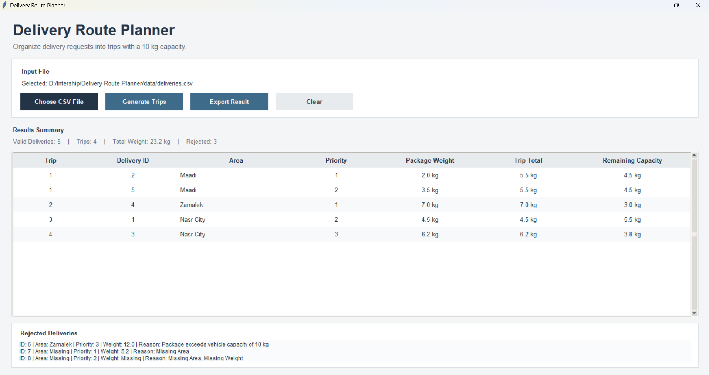

# Delivery Route Planner

A simple Python application that organizes delivery requests into delivery trips while respecting **vehicle capacity, delivery priority, and area grouping**.

The application reads delivery data from a CSV file, validates the input, and generates delivery trips with a maximum capacity of **10 kg per trip**.

## Features

* Reads delivery requests from a CSV file.
* Validates delivery data before processing.
* Handles missing and invalid values.
* Detects duplicate delivery IDs.
* Rejects packages heavier than 10 kg.
* Handles deliveries with the same priority.
* Groups deliveries from the same area where possible.
* Ensures every valid delivery appears in exactly one trip.
* Displays the **total weight of each trip**.
* Displays the **remaining vehicle capacity**.
* Displays rejected deliveries with the reason for rejection.
* Provides a simple graphical user interface using Tkinter.
* Exports generated trips and rejected deliveries to a CSV file.

## Project Structure

```text
delivery-route-planner/

│
├── src/
│   ├── main.py
│   └── delivery_planner.py
│
├── data/
│   ├── deliveries.csv
│   └── deliveries - empty.csv
│
├── screenshot/
│   └── running_program.png
│
├── README.md
└── requirements.txt
```

## How to Run

### Requirements

* Python 3.10 or later
* Tkinter

The project mainly uses Python's built-in libraries.

### Run the Application

Open a terminal in the project folder and run:

```bash
python src/main.py
```

The Delivery Route Planner GUI will open.

### Using the Application

1. Click **Choose CSV File**.
2. Select the delivery CSV file.
3. Click **Generate Trips**.
4. The generated trips will be displayed in the table.
5. Any invalid deliveries will be displayed in the **Rejected Deliveries** section.
6. Click **Export Result** to save the generated trips and rejected deliveries to a CSV file.
7. Click **Clear** to clear the selected file and displayed results.

## Input Format

The application uses a CSV file with the following columns:

```text
ID,Area,Priority,Weight
```

### Sample Input

```csv
ID,Area,Priority,Weight
1,Nasr City,2,4.5
2,Maadi,1,2.0
3,Nasr City,3,1.2
4,Zamalek,1,7.0
5,Maadi,2,3.5
```

Where:

* **ID**: Unique delivery identifier.
* **Area**: Delivery destination area.
* **Priority**: Lower numbers represent higher urgency.
* **Weight**: Package weight in kilograms.

# 1. Solution Approach

I divided the solution into three main steps: **reading the input, validating the deliveries, and creating the trips**. During trip creation, the valid deliveries are sorted by priority, area, and ID.

## Reading the Input

The program reads the delivery requests from the CSV file using Python's `csv` module.

Each delivery contains:

* ID
* Area
* Priority
* Weight
* Row number in the CSV file

## Validating the Input

Before creating trips, the program checks whether the delivery data is valid.

It checks for:

* Missing values.
* Invalid numbers.
* Duplicate delivery IDs.
* Zero or negative priority.
* Zero or negative weight.
* Packages exceeding the 10 kg capacity.

Invalid deliveries are rejected and displayed with the reason for rejection, while valid deliveries continue to be processed.

The program also checks that the required CSV columns are present:

* ID
* Area
* Priority
* Weight

If required columns are missing, trip generation is stopped and the missing columns are displayed in the **Rejected Deliveries** section.

## Sorting the Deliveries

Valid deliveries are sorted using:

```python
(priority, area, id)
```

This means:

1. **Priority comes first.**
2. If the priority is the same, **area is used for grouping/order**.
3. If both the priority and area are the same, **ID is used as a consistent tie-breaker**.

This gives the program a consistent processing order while keeping lower priority numbers first.

## Creating the Trips

The program starts a new trip with the first remaining delivery.

Then it checks the remaining deliveries and tries to add deliveries from the **same area** if they fit within the 10 kg capacity.

Before adding a delivery, the program checks:

```python
current_weight + delivery["weight"] <= MAX_CAPACITY
```

If adding the delivery would exceed 10 kg, it is not added to the current trip and will be considered for another trip.

For example:

```text
Trip 1:

ID 2 = 2.0 kg
ID 5 = 3.5 kg

Total Weight = 5.5 kg
Remaining Capacity = 4.5 kg
```

This ensures that a trip never exceeds the vehicle's capacity.

# 2. What Was the Most Difficult Part of the Assignment?

The most difficult part was balancing **priority, area grouping, and the 10 kg capacity** at the same time.

For example, deliveries with the same priority can belong to different areas, while deliveries from the same area can have different priorities.

The program needs to consider priority while also trying to group deliveries from the same area.

Another challenge is the vehicle capacity. Even when two deliveries belong to the same area, they cannot be placed in the same trip if their combined weight exceeds 10 kg.

I handled this by:

* Sorting deliveries by priority.
* Using area as a secondary ordering.
* Using ID as a consistent tie-breaker.
* Trying to group deliveries from the same area.
* Checking the 10 kg capacity before adding each delivery.

This provides a simple and consistent approach that is easy to understand and explain.

# 3. Are There Situations Where the Algorithm May Not Produce the Best Possible Grouping?

Yes. The algorithm uses a **greedy approach**, so it may not always produce the mathematically best possible grouping.

The algorithm makes decisions based on the current trip instead of checking every possible combination of deliveries.

For example, several deliveries may have weights that could be combined in a different way to use the 10 kg capacity more efficiently.

However, finding the globally optimal grouping can require considering many possible combinations of deliveries, which would make the solution more complicated and potentially slower.

I chose the greedy approach because the assignment focuses on a **simple, understandable, and consistent solution** rather than an advanced optimization algorithm.

# 4. What Could Become Slow or Memory-Intensive With 1,000,000 Requests?

The main memory concern would be storing all delivery records in Python lists.

Currently, the program reads the CSV and stores the delivery records before processing them.

With **1,000,000 delivery requests**, storing all these records could require a significant amount of memory.

The sorting step could also become more expensive because all valid deliveries need to be sorted.

The GUI could also become slow or memory-intensive if it tried to display a very large number of deliveries at once.

For a very large dataset, I would consider processing the input in **chunks** or using a more memory-efficient approach instead of keeping everything in memory.

# 5. What Would I Improve If I Had Another Day?

If I had another day, I would improve the solution in several areas.

## Better Trip Optimization

I would investigate a more advanced grouping algorithm that could use the 10 kg capacity more efficiently while still respecting priority and area grouping.

## Large Dataset Handling

I would improve the input processing so that very large CSV files could be processed without loading all deliveries into memory at once.

## Delivery Search and Filtering

I would add search and filtering options to the GUI so that users can quickly find specific deliveries or trips.

For example, the user could:

* Search for a specific Delivery ID.
* Filter deliveries by Area.
* Filter deliveries by Priority.
* View only deliveries from a selected trip.

This would make the application easier to use when working with a large number of deliveries, because users would not need to manually look through the entire results table.


# Additional Feature

## CSV Export

I also added a CSV export feature that allows the user to save the generated results.

The exported file contains:

* An **Accepted Deliveries** section.
* Trip number.
* Delivery ID.
* Area.
* Priority.
* Package weight.
* Trip total weight.
* Remaining capacity.
* A **Rejected Deliveries** section when rejected deliveries exist.
* The reason for each rejected delivery.

This allows the user to save and use the results outside the application.

## Trip Weight and Remaining Capacity

I added **trip weight and remaining capacity information** to the GUI.

For each generated trip, the application displays:

* **Trip Total**: The total weight of all deliveries in the trip.
* **Remaining Capacity**: The remaining capacity out of the 10 kg vehicle limit.

For example:

```text
Trip Total: 5.5 kg
Remaining Capacity: 4.5 kg
```

This helps the user quickly understand how much vehicle capacity is being used and how much capacity is still available.

I chose this feature because it is directly related to the delivery planning problem and gives the user more useful information about each generated trip.

## Input Validation

The application also validates the input data before creating trips.

It can detect:

* Missing ID.
* Missing Area.
* Missing Priority.
* Missing Weight.
* Invalid ID.
* Invalid Priority.
* Invalid Weight.
* Duplicate delivery IDs.
* Zero or negative priority.
* Zero or negative weight.
* Packages exceeding the 10 kg capacity.

Rejected deliveries are displayed in the GUI together with the reason they were rejected.

For example:

```text
ID: 2 | Area: Nasr City | Priority: Missing | Weight: 5 | Reason: Missing Priority
```

This allows valid deliveries to continue being processed without stopping the entire program because of one invalid record.


## Missing Column Handling

The application checks the CSV header before processing the delivery records.

The required columns are:

* ID
* Area
* Priority
* Weight

If one or more required columns are missing, the application does not generate trips and displays the missing column or columns in the **Rejected Deliveries** section.

# Sample Result

For the sample input:

```csv
ID,Area,Priority,Weight
1,Nasr City,2,4.5
2,Maadi,1,2.0
3,Nasr City,3,1.2
4,Zamalek,1,7.0
5,Maadi,2,3.5
```

The application generates trips while respecting the **10 kg capacity**.

The GUI displays:

* Trip number.
* Delivery ID.
* Area.
* Priority.
* Package weight.
* Trip total weight.
* Remaining capacity.

# Screenshot

## Running Program

The following screenshot shows the Delivery Route Planner running with the generated trips:



# Technologies Used

* **Python**
* **Tkinter**
* **CSV**
